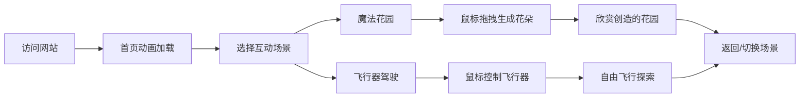

## 1. 产品概述
「奇迹互动花园」是一个沉浸式互动体验网站，用户可以通过鼠标操作创造魔法花朵、操控飞行器，在数字世界中体验创造的乐趣。

- 核心价值：将简单的鼠标操作转化为富有美感的创意体验
- 目标用户：所有喜欢创意互动、视觉艺术的互联网用户
- 产品定位：类似于 makemepluse 的高品质互动娱乐网站

## 2. 核心功能

### 2.1 用户角色
| 角色 | 注册方式 | 核心权限 |
|------|----------|----------|
| 访客用户 | 无需注册 | 体验所有互动功能，欣赏视觉效果 |

### 2.2 功能模块
1. **首页**：导航菜单、互动入口选择、欢迎动画
2. **魔法花园**：鼠标拖拽生成花朵，花瓣随风飘散
3. **飞行器驾驶**：鼠标控制飞行器起飞/降落/转向，穿越云海
4. **关于页面**：项目介绍、操作指引

### 2.3 页面详情
| 页面名称 | 模块名称 | 功能描述 |
|---------|----------|----------|
| 首页 | Hero 区域 | 全屏渐变背景，浮动粒子效果，入口卡片动画 |
| 魔法花园 | 画布区域 | 鼠标按下拖拽生成花朵，释放后花瓣飘散，可清除重画 |
| 魔法花园 | 控制面板 | 花朵颜色选择器、大小调节、重置按钮 |
| 飞行器驾驶 | 游戏画布 | 鼠标移动控制飞行器位置，点击加速起飞，松开减速降落 |
| 飞行器驾驶 | HUD 显示 | 飞行高度、速度、续航实时显示，云层动态背景 |

## 3. 核心流程

用户打开网站 → 首页欢迎动画加载完成 → 选择互动体验（魔法花园/飞行器驾驶）→ 进入对应场景 → 根据提示进行鼠标操作 → 享受互动创造乐趣 → 可随时切换场景或返回首页

## 4. 用户界面设计

### 4.1 设计风格
- **美学方向**：梦幻有机 + 极简主义
- **主色调**：薰衣草紫 (#667eea) → 玫瑰粉 (#f093fb) 渐变作为主色调
- **辅助色**：薄荷绿 (#4facfe)、晴空蓝 (#00f2fe)、暖阳橙 (#fa709a)
- **中性色**：深靛蓝 (#0f0c29) 背景，纯白 (#ffffff) 文字，半透明玻璃态 UI
- **按钮风格**：玻璃拟态 (Glassmorphism)，圆角 16px，微磨砂背景，发光边框
- **字体**：标题使用 'Playfair Display' 优雅衬线字体，正文使用 'Outfit' 现代无衬线字体
- **布局风格**：全屏沉浸式画布，浮动式 UI 控件，大量负空间
- **动效风格**：缓入缓出曲线 (cubic-bezier(0.4, 0, 0.2, 1))，物理模拟动画，粒子系统

### 4.2 页面设计概述
| 页面名称 | 模块名称 | UI 元素 |
|---------|----------|----------|
| 首页 | Hero 区域 | 动态渐变背景、漂浮光斑粒子、入口卡片悬停效果、标题打字机效果 |
| 魔法花园 | 画布 | Canvas 全屏画布、鼠标跟随发光轨迹、花朵绽放动画、花瓣飘散粒子 |
| 魔法花园 | 控制面板 | 玻璃态面板、颜色选择器、滑块控件、重置按钮、操作提示 |
| 飞行器驾驶 | 游戏画布 | 动态云层、远山剪影、飞行器精灵、尾焰粒子、地形滚动 |
| 飞行器驾驶 | HUD | 高度表、速度表、电量指示、操作指引、返回按钮 |

### 4.3 响应式设计
- 桌面端优先，自适应 1024px 及以上屏幕
- 平板端：缩小 UI 控件尺寸，优化触控区域
- 移动端：保留核心交互，简化控制选项
- 触摸优化：增加触摸事件支持，适配多指操作

### 4.4 视觉与动画细节
- **鼠标光标**：自定义发光光标，交互时放大变形
- **页面过渡**：平滑淡入淡出，缩放切换
- **微交互**：按钮悬停有轻微上浮和发光，滑块有跟随高亮
- **背景氛围**：魔法花园使用星空粒子背景，飞行器使用流动云层背景
- **性能优化**：使用 requestAnimationFrame 驱动动画，Canvas 分层渲染
