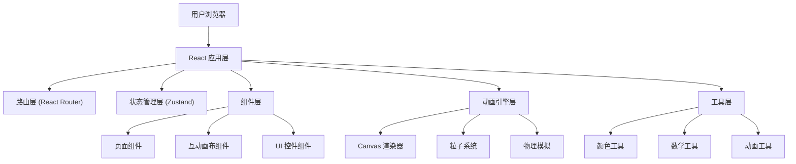

## 1. 架构设计

本项目为纯前端互动体验网站，采用分层架构设计，确保代码可维护性和性能优化。



## 2. 技术描述

- **前端框架**: React@18 + TypeScript@5
- **构建工具**: Vite@5 (快速热更新，优化构建)
- **样式方案**: TailwindCSS@3 (原子化 CSS) + 自定义 CSS 变量
- **状态管理**: Zustand@4 (轻量级状态管理)
- **路由管理**: React Router DOM@6 (单页路由)
- **图标库**: lucide-react@latest (现代 SVG 图标)
- **动画方案**: 
  - requestAnimationFrame 驱动 Canvas 动画
  - CSS transitions / keyframes 用于 UI 动画
  - 自定义粒子系统引擎
- **渲染技术**: HTML5 Canvas 2D API (高性能图形渲染)

## 3. 路由定义

| 路由路径 | 页面名称 | 组件路径 | 功能描述 |
|---------|----------|----------|----------|
| `/` | 首页 | `src/pages/Home.tsx` | 欢迎页面，展示互动入口 |
| `/garden` | 魔法花园 | `src/pages/Garden.tsx` | 鼠标拖拽生成花朵互动 |
| `/flight` | 飞行器驾驶 | `src/pages/Flight.tsx` | 鼠标控制飞行器互动 |
| `/about` | 关于 | `src/pages/About.tsx` | 项目介绍和操作说明 |
| `*` | 404 页面 | `src/pages/NotFound.tsx` | 路由不存在时的回退页面 |

## 4. 项目目录结构

```
src/
├── components/           # 可复用组件
│   ├── layout/          # 布局组件
│   │   ├── Navbar.tsx   # 导航栏
│   │   └── PageTransition.tsx  # 页面过渡动画
│   ├── ui/              # UI 组件
│   │   ├── GlassCard.tsx       # 玻璃态卡片
│   │   ├── ColorPicker.tsx     # 颜色选择器
│   │   ├── Slider.tsx          # 滑块控件
│   │   └── Button.tsx          # 按钮组件
│   └── canvas/          # Canvas 相关组件
│       ├── FlowerGarden.tsx    # 花朵画布
│       └── FlightSimulator.tsx # 飞行器画布
├── pages/               # 页面组件
│   ├── Home.tsx
│   ├── Garden.tsx
│   ├── Flight.tsx
│   ├── About.tsx
│   └── NotFound.tsx
├── hooks/               # 自定义 Hooks
│   ├── useCanvas.ts           # Canvas 管理 Hook
│   ├── useParticleSystem.ts   # 粒子系统 Hook
│   ├── useMouseTracker.ts     # 鼠标追踪 Hook
│   └── useAnimationFrame.ts   # RAF 循环 Hook
├── store/               # 状态管理
│   └── useAppStore.ts
├── utils/               # 工具函数
│   ├── colors.ts        # 颜色处理工具
│   ├── math.ts          # 数学计算工具
│   └── animation.ts     # 动画工具函数
├── types/               # TypeScript 类型定义
│   ├── flower.ts        # 花朵相关类型
│   ├── flight.ts        # 飞行器相关类型
│   └── particle.ts      # 粒子系统类型
├── App.tsx              # 应用根组件
├── main.tsx             # 应用入口
└── index.css            # 全局样式
```

## 5. 核心数据结构

### 5.1 花朵数据类型
```typescript
interface Petal {
  x: number;
  y: number;
  angle: number;
  length: number;
  width: number;
  color: string;
  opacity: number;
  rotation: number;
}

interface Flower {
  id: string;
  x: number;
  y: number;
  centerX: number;
  centerY: number;
  petals: Petal[];
  centerColor: string;
  petalColor: string;
  size: number;
  bloomProgress: number;
  createdAt: number;
}

interface Particle {
  id: string;
  x: number;
  y: number;
  vx: number;
  vy: number;
  size: number;
  color: string;
  opacity: number;
  life: number;
  maxLife: number;
}
```

### 5.2 飞行器数据类型
```typescript
interface Aircraft {
  x: number;
  y: number;
  targetX: number;
  targetY: number;
  velocityX: number;
  velocityY: number;
  angle: number;
  speed: number;
  maxSpeed: number;
  altitude: number;
  fuel: number;
  maxFuel: number;
  isThrusting: boolean;
}

interface Cloud {
  x: number;
  y: number;
  width: number;
  height: number;
  speed: number;
  opacity: number;
}

interface Mountain {
  x: number;
  height: number;
  width: number;
  color: string;
}
```

## 6. 核心算法

### 6.1 花朵生成算法
- 根据鼠标拖拽速度和距离计算花朵大小
- 使用贝塞尔曲线绘制平滑花瓣形状
- 随机生成花瓣数量（5-12片）和角度分布
- 绽放动画使用 easeOutBack 缓动函数

### 6.2 粒子系统
- 对象池模式管理粒子生命周期
- 物理模拟：重力、空气阻力、风力
- 花瓣飘散使用正弦函数模拟飘动效果

### 6.3 飞行器物理
- 平滑追随算法 (Lerp) 跟随鼠标位置
- 推进力模拟：速度 = 速度 + 加速度 * 时间
- 空气阻力：速度 = 速度 * (1 - 阻力系数)
- 倾斜角度根据速度向量计算

## 7. 性能优化策略

1. **Canvas 分层渲染**：背景层、主体层、特效层分离
2. **离屏渲染**：静态元素预渲染到离屏 Canvas
3. **对象池复用**：粒子对象循环使用，避免频繁 GC
4. **节流防抖**：鼠标事件使用 requestAnimationFrame 节流
5. **按需渲染**：无交互时降低帧率，节省资源
6. **硬件加速**：CSS `will-change` 和 `transform` 优化
